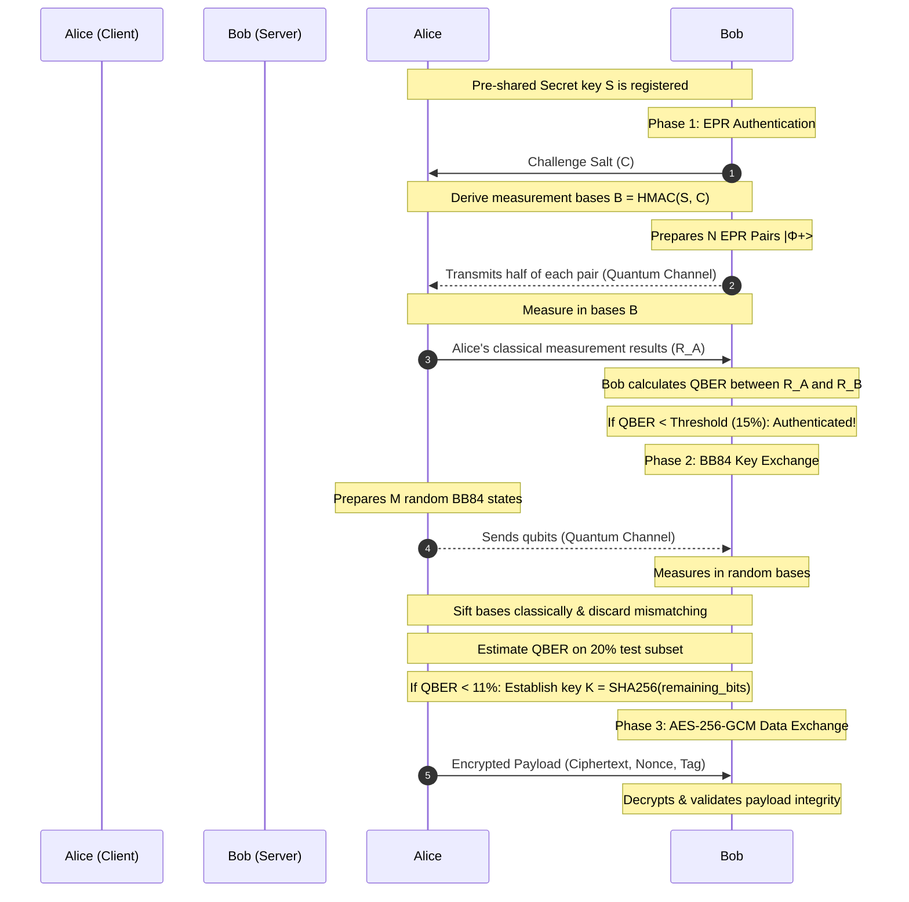

# Quantum Identity Authentication and Key Exchange Simulation

A high-fidelity simulation testbed built on Qiskit's `AerSimulator` to prototype and analyze a hybrid quantum-classical security handshake. The protocol integrates **EPR-based statistical challenge-response authentication** and **BB84 key distribution** to establish a secure session key for classical **AES-256-GCM** encryption.

---

## 1. Project Framing, Scope & Assumptions

> [!WARNING]
> **Simulation Study Scope**: This software is an academic simulation study validating protocol logic, statistical thresholds, and attack detection mechanisms under idealized channel models.
> - **No Physical Transmission**: There is no actual physical transport of qubits. Both Alice, Bob, and the quantum channel are simulated inside the same memory space using Qiskit.
> - **Channel Attacks**: Intercept-resend and noise are simulated mathematically by applying unitary transformations, noise operators, and intermediate measurement projections to the quantum registers.
> - **Physical Constraints**: A deployable physical system would require dedicated photonic hardware (fiber-optic or free-space quantum channels, single-photon detectors, and cryo-coolers) which is entirely outside this project's scope.

### Threats and Assumptions
- **Pre-Shared Secret**: Alice and Bob share a high-entropy secret key $S$ registered out-of-band prior to authentication.
- **Classical Channel**: Alice and Bob have access to an unauthenticated, public classical channel. BB84 requires authenticated classical communication; we solve this bootstrapping problem by completing EPR authentication *before* starting BB84.
- **Attacker Capabilities (Eve)**: Eve can actively intercept and measure qubits on the quantum channel (intercept-resend), inject fake signals (impersonation), or replay past classical messages (replay attacks). She does *not* possess the pre-shared secret $S$.

---

## 2. Protocol Details & Mathematical Flow



### Phase 1: EPR Challenge-Response Authentication
1. **Challenge Generation**: Bob generates a random 128-bit challenge salt $C$.
2. **Basis Derivation**: Alice and Bob derive a sequence of basis selection bits $B = (b_1, \dots, b_N) \in \{0, 1\}^N$ using:
   $$b_i = \text{HMAC-SHA256}(S, C \parallel i) \pmod 2$$
   Where $b_i = 0$ corresponds to measuring in the computational ($Z$) basis, and $b_i = 1$ in the diagonal ($X$) basis.
3. **EPR Pair Distribution**: Bob prepares $N$ Bell pairs in the $|\Phi^+\rangle = \frac{1}{\sqrt{2}}(|00\rangle + |11\rangle)$ state. He keeps the first qubit $B_i$ and transmits the second qubit $A_i$ to Alice over the channel.
4. **Measurement**: Alice measures her received qubits $A_i$ in bases $B$, and Bob measures $B_i$ in bases $B$.
5. **Statistical Verification**: Alice transmits her classical measurement outcomes $R_A = (a_1, \dots, a_N)$ to Bob. Bob computes the Quantum Bit Error Rate (QBER):
   $$\text{QBER}_{auth} = \frac{1}{N} \sum_{i=1}^N a_i \oplus b'_i$$
   Bob accepts Alice's identity if and only if $\text{QBER}_{auth} < \theta$ (default $\theta = 15\%$).

### Phase 2: BB84 Quantum Key Distribution
Once authenticated:
1. Alice prepares $M$ qubits in random BB84 states (random bits $X_A$ in random bases $B_A$).
2. Alice transmits these qubits to Bob. Bob measures them in random bases $B_B$.
3. **Sifting**: They announce their bases over the classical channel and discard positions where bases mismatched.
4. **Parameter Estimation**: They verify a subset (e.g. 20%) of the sifted bits to estimate $\text{QBER}_{key}$. If $\text{QBER}_{key} \le 11\%$, the exchange succeeds.
5. **Key Derivation**: They apply SHA-256 to the remaining sifted bits to extract a uniform 256-bit AES key.

### Phase 3: Classical Encryption
Alice encrypts her message using AES-256-GCM with the derived key and sends the (ciphertext, nonce, tag) to Bob, who decrypts and validates payload integrity.

---

## 3. Threat Model Simulation & Attack Scenarios

The simulator supports 5 distinct execution modes to analyze security:
1. **Normal Flow**: Honest Alice and Bob communicate over a channel with baseline noise (default 2% depolarizing noise). Handshake and encryption succeed.
2. **Active Eavesdropping (MitM)**: Eve intercepts qubits during transmission and measures them in random bases (intercept-resend). This perturbs the states, raising the QBER during authentication to $\approx 25\%$ (plus channel noise) and during BB84 to $\approx 25\%$, causing immediate detection and abort.
3. **Active Impersonation**: Eve attempts to authenticate as Alice. Lacking secret $S$, her derived measurement bases mismatch Bob's 50% of the time, resulting in a QBER of $\approx 50\%$, which fails the statistical verification threshold.
4. **Replay Attack**: Eve captures Alice's classical response $R_A^{prev}$ from a previous session and replays it. Because Bob's new challenge $C_{new}$ yields independent measurement bases, the replayed response mismatches Bob's new measurements, resulting in $\approx 50\%$ QBER and rejection.
5. **Wrong Secret**: An unauthorized user tries to connect using an incorrect pre-shared secret, leading to basis mismatch and rejection.

---

## 4. Setup and Execution Guide

### Prerequisites
Ensure you have Python 3.10+ installed.

### Installation
1. Clone this repository and navigate to the project directory.
2. Initialize and activate a virtual environment:
   ```bash
   python3 -m venv .venv
   source .venv/bin/activate
   ```
3. Install the dependencies:
   ```bash
   pip install -r requirements.txt
   ```

### Running Simulations

#### 1. Run standard noiseless/noisy handshake flow:
```bash
python3 main.py run-flow --noise-rate 0.02 --epr-size 100 --bb84-size 100
```

#### 2. Run a specific attack scenario (e.g., active eavesdropping):
```bash
python3 main.py run-attack eavesdrop --noise-rate 0.02
```
Other attack choices: `impersonate`, `replay`, `wrong_secret`.

#### 3. Run comprehensive statistical benchmarks:
```bash
python3 main.py benchmark --iterations 50 --plot-iterations 20
```
This runs each scenario 50 times, outputs a summary markdown table of results, and generates plotting diagrams in the `diagrams/` directory:
- `diagrams/qber_vs_noise.png`: Compares QBER in normal and eavesdropped scenarios across different channel noise rates.
- `diagrams/detection_vs_batch_size.png`: Shows how increasing the EPR batch size ($N$) boosts attack detection confidence.
